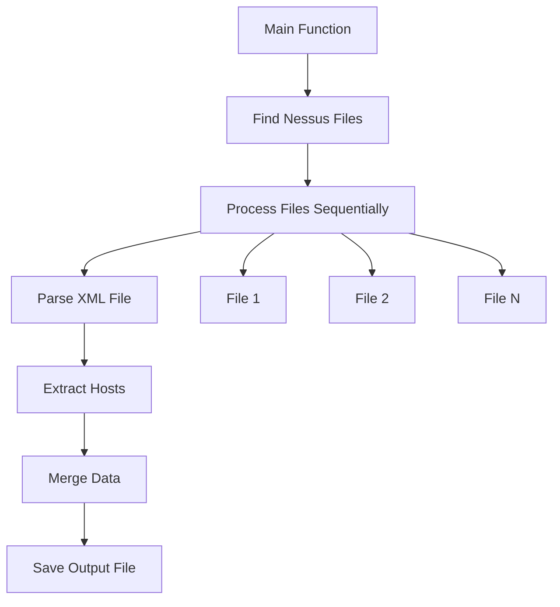
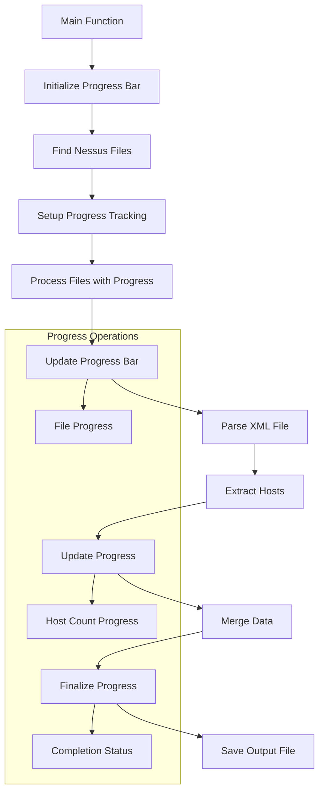
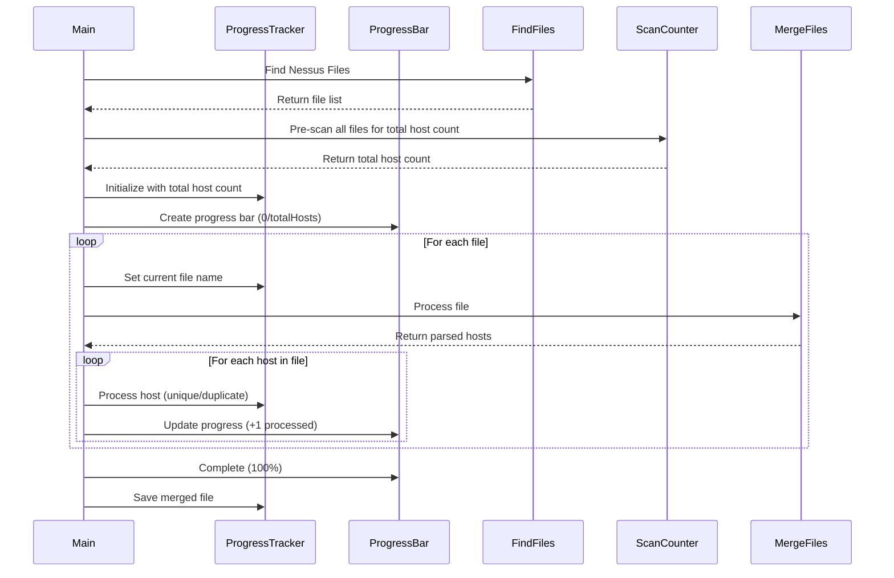
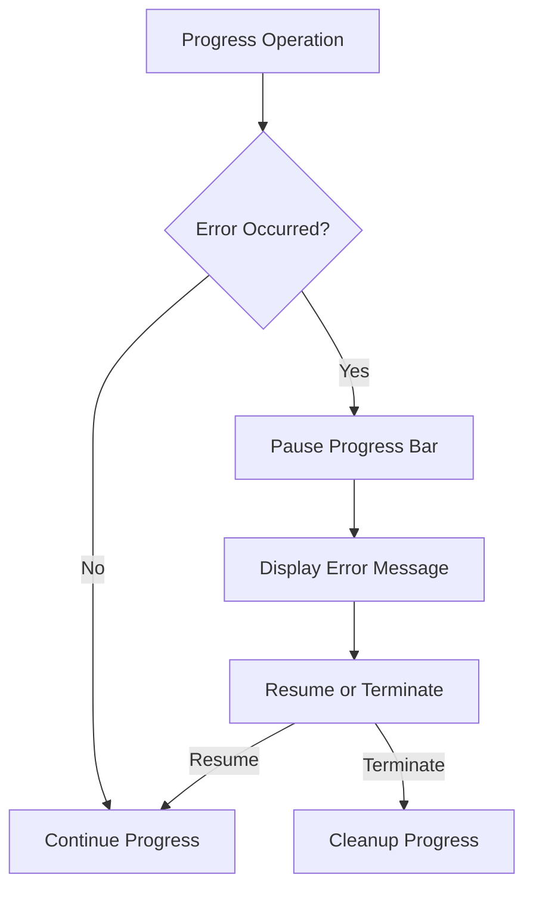
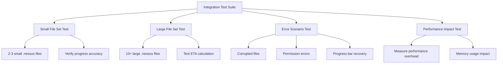

# Nessus Scan Merger Progress Bar Enhancement

## Overview

This document outlines the design for adding a visual progress bar to the existing Nessus scan merger CLI tool. The enhancement will provide real-time feedback to users during the file processing and merging operations, improving user experience by showing progress, estimated time remaining, and current operation status.

## Architecture

### Current Architecture Analysis

The existing application follows a simple CLI architecture:



### Enhanced Architecture with Progress Bar



## Progress Bar Implementation Strategy

### Technology Selection

**Selected Library:** `github.com/schollz/progressbar/v3`

**Rationale:**
- Lightweight and actively maintained
- Supports multiple progress indicators
- Customizable appearance and behavior
- Built-in support for bytes, iterations, and time estimation
- Compatible with Go 1.21

### Progress Tracking Strategy

**Single Progress Bar Approach**: Track total host processing progress across all files
- Calculate total host count from all .nessus files at the beginning
- Update progress bar as hosts are processed and merged
- Show current processed hosts vs total hosts with percentage

### Progress Bar Components

```mermaid
graph TD
    A[Single Progress Bar] --> B[Total Host Count]
    A --> C[Processed Hosts]
    A --> D[Current File Info]
    
    B --> B1[Pre-scan all files for host count]
    C --> C1[Hosts processed so far]
    C --> C2[Unique hosts added]
    C --> C3[Duplicate hosts skipped]
    
    D --> D1[Current file being processed]
    D --> D2[Processing speed (hosts/sec)]
```

## Implementation Design

### Data Structures Enhancement

```go
type ProgressTracker struct {
    ProgressBar     *progressbar.ProgressBar
    TotalHosts      int
    ProcessedHosts  int
    UniqueHosts     int
    DuplicateHosts  int
    CurrentFileName string
    StartTime       time.Time
}
```

### Function Modifications

#### Enhanced Main Function Flow



#### Progress Bar Display Format

**Single Unified Progress Bar:**

| Phase | Display Format |
|-------|----------------|
| Counting Hosts | `Scanning files for host count...` |
| Processing Hosts | `Processing hosts [████████░░] 800/1000 (80%) \| scan_file.nessus \| 45 hosts/sec` |
| Completed | `✓ Processed 1000 hosts (850 unique, 150 duplicates) in 22.3s` |

**Progress Information:**
- Current/Total hosts with percentage
- Current file being processed
- Processing speed (hosts per second)
- Unique vs duplicate host counts

### Error Handling with Progress



### Configuration Options

Progress bar behavior will be configurable through command-line flags:

| Flag | Description | Default |
|------|-------------|---------|
| `--quiet` | Disable progress bar | false |
| `--progress-style` | Progress bar style (bar, spinner, simple) | bar |
| `--show-speed` | Show processing speed | true |
| `--show-eta` | Show estimated time remaining | true |

## User Interface Design

### Progress Bar Visual Elements

```
Host Processing Progress:
┌─────────────────────────────────────────────────────────────┐
│ Processing hosts: scan_results_2024.nessus                 │
│ ████████████████████████░░░░░░░░░ 800/1000 (80%) | ETA: 4s │
│ Speed: 45 hosts/sec | Unique: 680 | Duplicates: 120       │
└─────────────────────────────────────────────────────────────┘

Completion Summary:
┌─────────────────────────────────────────────────────────────┐
│ ✓ Processed 1000 hosts from 7 files                       │
│ ✓ Unique hosts: 850 | Duplicates skipped: 150             │
│ ✓ Output saved: merged_nessus_report.nessus (2.8MB)       │
│ ✓ Completed in 22.3s (avg: 45 hosts/sec)                  │
└─────────────────────────────────────────────────────────────┘
```

## Testing Strategy

### Unit Testing Scope

1. **Progress Tracker Operations**
   - Progress calculation accuracy
   - State transitions
   - Error handling during progress updates

2. **Progress Bar Integration**
   - Progress bar initialization
   - Update mechanisms
   - Cleanup operations

3. **User Interface Testing**
   - Visual progress representation
   - Progress bar completion states
   - Error message display

### Integration Testing



## Performance Considerations

### Progress Bar Overhead

- Progress updates limited to reasonable intervals (every 100ms minimum)
- Efficient progress calculation to avoid performance degradation
- Memory-conscious progress tracking to handle large file sets

### Optimization Strategies

1. **Batched Updates**: Group multiple host additions before updating progress
2. **Conditional Rendering**: Skip progress updates for very fast operations
3. **Memory Efficiency**: Use lightweight progress tracking structures

## Dependencies Management

### New Dependencies

```go
// go.mod additions
require (
    github.com/schollz/progressbar/v3 v3.14.1
)
```

### Dependency Justification

- **progressbar/v3**: Mature, well-maintained library with comprehensive features
- **Minimal footprint**: Adds ~200KB to binary size
- **Zero breaking changes**: Maintains backward compatibility with existing functionality